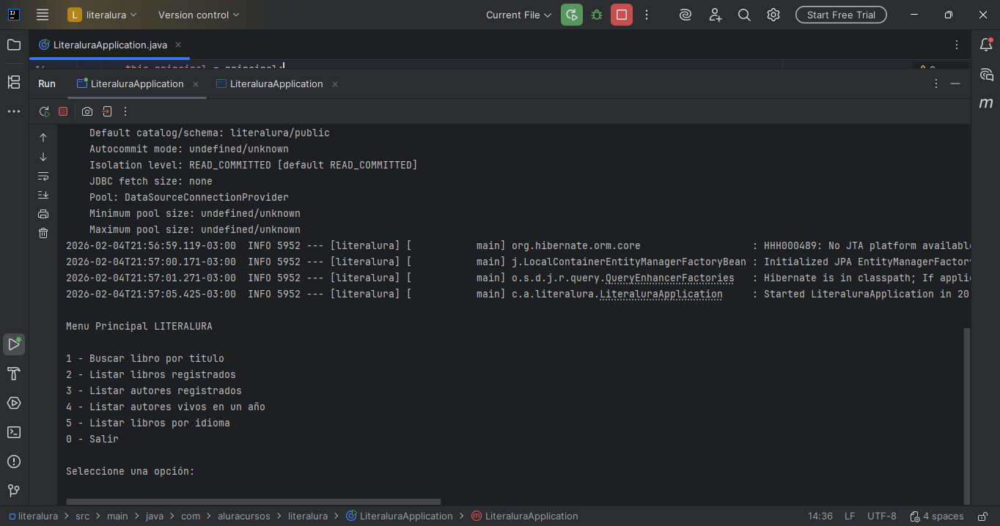
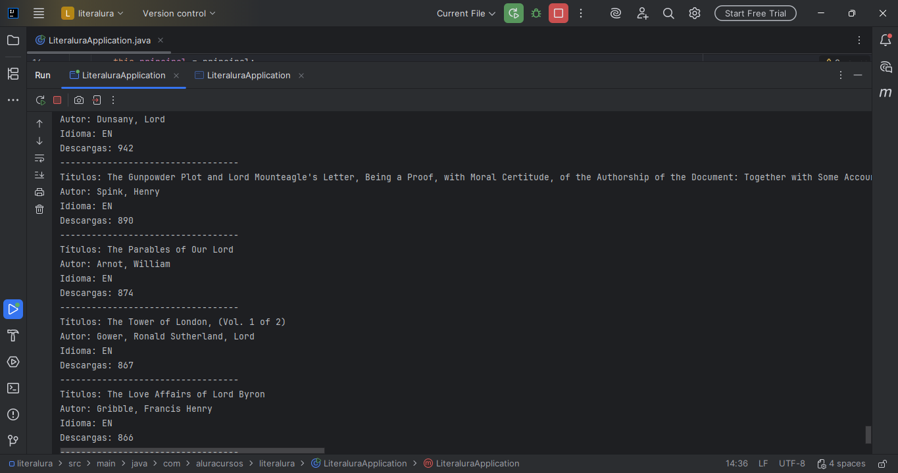

📚 Literalura – Catálogo de Libros

Proyecto desarrollado en Java con Spring Boot que permite consultar libros desde la API de Gutendex y almacenarlos en una base de datos para su posterior consulta.

Forma parte del challenge del curso Java Backend – Alura / Oracle Next Education.

🚀 Funcionalidades

El sistema funciona mediante un menú por consola y permite:

1️⃣ Buscar libros por título
2️⃣ Listar libros registrados en la base de datos
3️⃣ Listar autores registrados
4️⃣ Listar autores vivos en un año determinado
5️⃣ Listar libros filtrados por idioma

🛠️ Tecnologías utilizadas

Java 17

Spring Boot

Spring Data JPA

Hibernate

PostgreSQL / H2

API Gutendex

Maven

🧩 Modelo de datos

Autor

Nombre

Año de nacimiento

Año de fallecimiento

Libro

Título

Idioma

Número de descargas

Autor

Relación:

Un autor puede tener varios libros (@OneToMany)

Cada libro pertenece a un autor (@ManyToOne)

▶️ Ejecución del proyecto

Clonar el repositorio

Configurar la base de datos en application.properties

Ejecutar la aplicación desde IntelliJ

Utilizar el menú interactivo por consola

📸 Capturas de pantalla
Menú principal

Listado de autores vivos

Base de datos - Libros registrados

👤 Autor

Mario Enrique Vento Sanoja
Java Backend Developer en formación
Oracle Next Education – Alura

💡 Proyecto desarrollado con fines educativos.